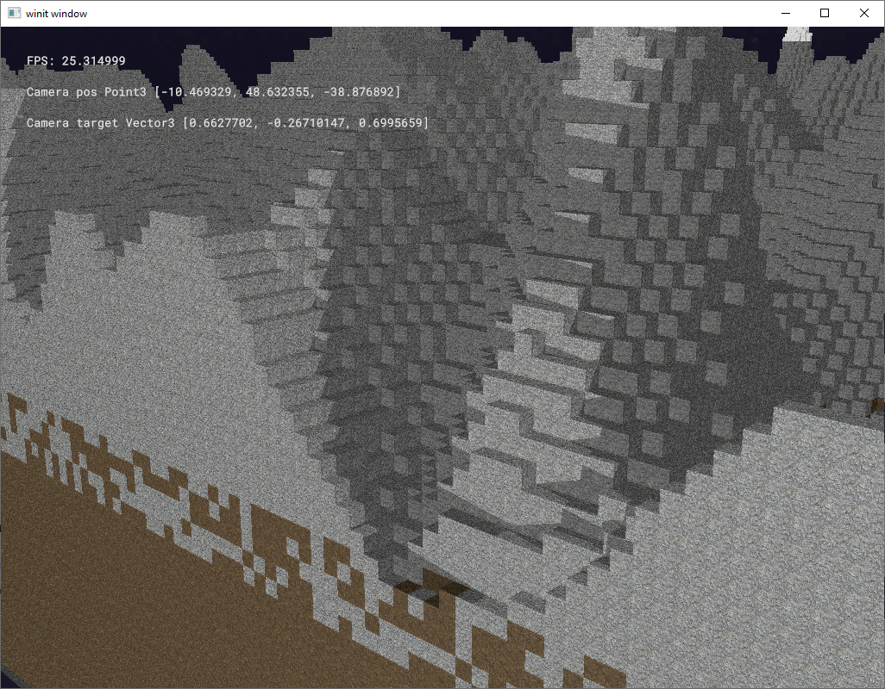

# ALVOX

Hi, stranger. Your found a repo of yet another attemt to build a voxel enging.
This project aims to teach me how to code in Rust, as well as develop a game.
The project has super early development pre-alpha stage.

Currently it is able to open a window and show a generated chunks with block


## How to run

1. clone the repo `git clone`
2. download Roboto_Mono fonts from google font and put them into `res/` folder
3. you need some textures
   ```rust
   pub const TEXTURE_NAMES: &'static [[&str; 3]; 6] = &[
       ["bedrock", "bedrock_n", "bedrock_s"],
       ["brick", "brick_n", "brick_s"],
       ["planks_oak", "planks_oak_n", "planks_oak_s"],
       ["dirt", "dirt_n", "dirt_s"],
       ["snow", "snow_n", "snow_s"],
       ["stone", "stone_n", "stone_s"],
   ];
   ```
   in `res/textures/block` folder. For the screenshot I've took some form `Pulchra-Revisited-Resource-Pack-128x` resource pack of minecraft
4. run `cargo run -p core`

## Key-bindings

`]` - run a light cw
`[` - run a light ccw

`5,6,7,` - set different shadow map resolution

`WASD,space, mouse` - to move the camera (standard FPS keybindings)
